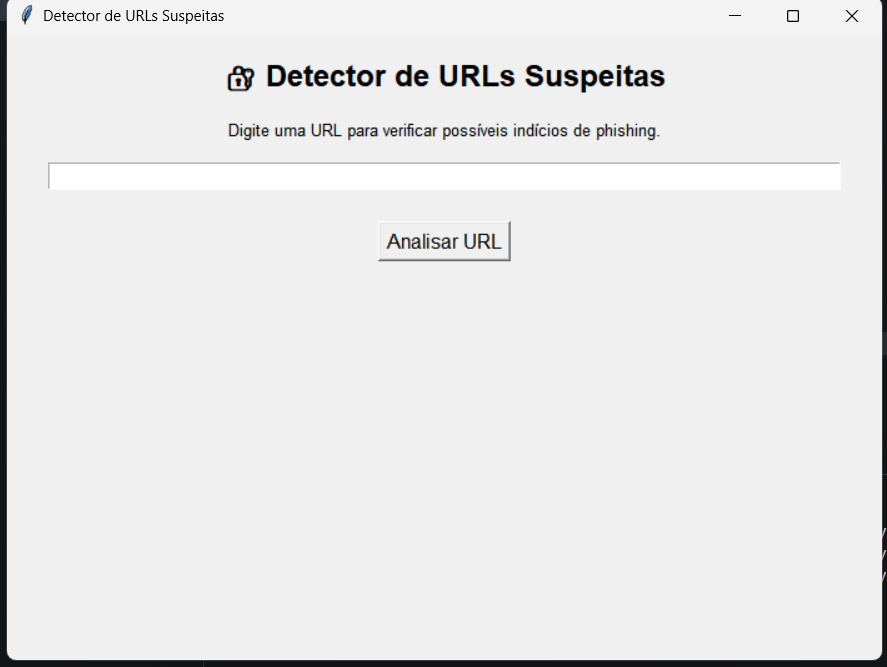
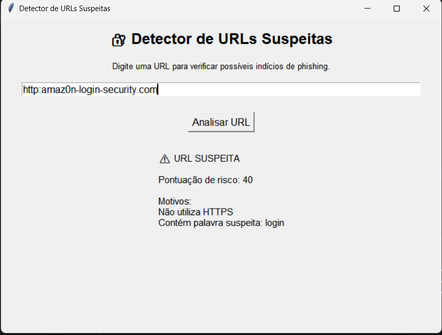

🔐 Detector de URLs Suspeitas

Aplicação desenvolvida em Python para identificar URLs potencialmente maliciosas com base em características comuns de phishing e golpes online.

O sistema realiza uma análise simples da URL informada pelo usuário e gera uma pontuação de risco com base em critérios de segurança.

🚀 Funcionalidades

* Verificação de HTTPS
* Identificação de palavras suspeitas
* Análise do tamanho da URL
* Detecção do caractere “@”
* Geração de pontuação de risco
* Interface gráfica desenvolvida com Tkinter

🛠️ Tecnologias Utilizadas

* Python 3
* Tkinter

📊 Critérios de Análise

O sistema verifica:

* Uso de HTTPS
* Presença de palavras suspeitas:
    * login
    * verify
    * secure
    * bank
    * update
    * free
    * bonus
    * pix
* URLs excessivamente longas
* Presença do caractere “@”

Com base nesses critérios é gerada uma pontuação de risco.

📷 Exemplo de Uso

URL analisada:

http://amaz0n-login-security.com

Resultado:

⚠ URL SUSPEITA

Motivos:

* Não utiliza HTTPS
* Contém palavra suspeita: login
* URL muito longa

📁 Estrutura do Projeto

detector-de-urls-suspeitas/

├── main.py

└── README.md

▶️ Como Executar

1. Clone o repositório

git clone https://github.com/seu-usuario/detector-de-urls-suspeitas.git

2. Entre na pasta

cd detector-de-urls-suspeitas

3. Execute o projeto

python main.py

ou

py main.py

🎯 Objetivo do Projeto

Este projeto foi desenvolvido para praticar:

* Python
* Interfaces gráficas com Tkinter
* Manipulação de strings
* Estruturas condicionais
* Conceitos básicos de cibersegurança
* Identificação de possíveis ataques de phishing

🔮 Melhorias Futuras

* Tema escuro
* Histórico de análises
* Barra visual de risco
* Exportação de relatórios
* Integração com APIs de reputação de URLs
* Verificação de domínios conhecidos por phishing

👨‍💻 Autor

Projeto desenvolvido para fins de estudo e prática de programação e cibersegurança.

